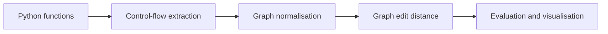

# Control Flow Graph Analysis using Graph Edit Distance

**Investigating structural similarity between Python programs through graph algorithms.**

Artur Istratov · Final-year Computer Science project · 2025/26

[← All projects](../README.md)

## The research problem

Programs can look different after variable renaming, dead-code insertion, or more substantial obfuscation. This final-year Computer Science project investigates how control-flow graphs and graph edit distance can help measure structural differences, with potential applications to obfuscation analysis in cybersecurity.

## The pipeline

The project extracts control-flow graphs from Python bytecode. The reported experiments use basic-block graphs, followed by structural role assignment, linear-chain collapsing, and breadth-first relabelling. Graph edit distance assigns a cost to transforming one graph into another through edits to nodes and edges.

## Technical highlights

- **Graph representations:** instruction-level graphs and basic-block graphs expose program structure at different levels of detail.
- **Normalisation:** structural role labels and linear-chain collapsing aim to reduce the influence of superficial differences.
- **Search strategies:** implementations include A* with an assignment-based heuristic, Dijkstra search, an adaptive strategy, and a matching-based approximation.
- **Cost models:** uniform and weighted edit costs allow investigation of how structural roles and edit types affect comparisons.
- **Evaluation tooling:** the pipeline records distance scores, similarity scores, runtime, and explored search states, with graph exports and heatmap generation.

## Reported results

The evaluation uses **12 synthetic Python samples**: one baseline, nine obfuscated variants, and two comparison controls. The reported classification results cover **11 comparisons against the baseline**, using the `compute` function and a size-normalised uniform-GED threshold of 0.75.

| Finding | Result in the report | Interpretation |
| --- | --- | --- |
| Variant classification | 9 of 11 comparisons correct; approximately 82% accuracy, 89% precision, and 89% recall | Eight true positives and one true negative, with one false positive and one false negative |
| Surface-level transformations | GED = 0 for variable renaming, dead-code insertion, no-op insertion, and expression splitting | These four samples retain matching graph structure after the pipeline |
| Search efficiency | Up to 86.6% fewer explored states with A* than Dijkstra under uniform costs | The largest reduction occurs for the bogus-exception sample |
| Runtime tradeoff | For the combined-obfuscation sample, A* takes 8.66 seconds versus Dijkstra's 5.68 seconds | Exploring fewer states can still take longer when the heuristic is expensive |

These are results reported in the final project report, rather than fresh benchmark runs. Classification figures come from the results and confusion-matrix tables on page 26; search and runtime figures come from page 29.

## Research contribution

The project brings together bytecode analysis, graph normalisation, custom GED search implementations, and a controlled evaluation of uniform versus weighted edit costs. It examines both the quality of structural comparisons and the cost of computing them.

One practical finding is that **stronger pruning does not automatically mean faster execution**: the cost of the Hungarian assignment heuristic can outweigh the work it saves on small graphs. Another is that structural similarity has limits: the combined-obfuscation variant is missed, while one unrelated control is classified as a variant.

## Technology

Python, NetworkX, NumPy, SciPy, and Matplotlib.

## Scope and limitations

This is an experimental research tool for small Python program graphs. The dataset is manually constructed from a single baseline, and the classification threshold was selected using the same dataset. These figures do not establish performance on unseen programs or real malware.

Structural similarity does not by itself establish equivalent behaviour or identify malicious software. Exact graph comparison can become computationally expensive as graphs grow; timeouts and approximate methods are relevant tradeoffs.

## What this project demonstrates

Algorithm implementation, program analysis, graph modelling, experimental design, and scientific visualisation.

**Source availability:** private implementation repository; this page is a project overview.

**Report:** Artur Istratov, *Control Flow Graph Analysis using Graph Edit Distance for Cybersecurity Applications*, final undergraduate project report, 6 May 2026.
