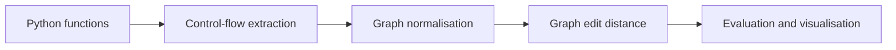

# Comparing program structure with graph edit distance

Artur Istratov · Final-year Computer Science project · 2025/26

[Back to projects](../README.md)

For this project, I investigated whether control-flow graphs could identify obfuscated versions of a Python function. Renaming variables can change how code looks while leaving its structure intact. Other transformations, such as control-flow flattening, make that comparison much harder.

I built a pipeline to extract program graphs, simplify them, and compare them using graph edit distance (GED). The cybersecurity question was how well structural comparison could recognise program variants.

## How it works

The pipeline extracts control-flow graphs from Python bytecode. It supports instruction-level and basic-block graphs; the reported experiments use basic blocks.

Before comparison, nodes receive structural roles, linear chains are collapsed, and nodes are relabelled through a breadth-first traversal. GED then measures the cost of transforming one graph into the other through node and edge edits.

I compared A* search with a Hungarian assignment heuristic against Dijkstra search. The implementation also includes an adaptive strategy and a matching-based approximation. Uniform and weighted edit costs let me examine how the cost of different structural changes affects the comparison.

The evaluation records distance and similarity scores, runtime, and explored search states. It also exports graphs and produces heatmaps. The stack is Python, NetworkX, NumPy, SciPy, and Matplotlib.

## What the experiment found

The dataset contains 12 synthetic Python samples: a baseline, nine obfuscated variants, and two comparison controls. Classification uses 11 comparisons against the baseline's `compute` function, with a threshold of 0.75 on size-normalised uniform GED.

| Measurement | Reported result |
| --- | --- |
| Correct classifications | 9 of 11: eight true positives and one true negative |
| Classification errors | One false positive and one false negative |
| Accuracy, precision, and recall | Approximately 82%, 89%, and 89% respectively |
| Surface-level changes | GED = 0 for variable renaming, dead-code insertion, no-op insertion, and expression splitting |
| Largest reduction in search states | A* explored 86.6% fewer states than Dijkstra for the bogus-exception sample under uniform costs |
| Combined-obfuscation runtime | A*: 8.66 seconds; Dijkstra: 5.68 seconds |

These figures are from the final report, not a new benchmark run. The classification and confusion-matrix tables are on page 26; the search and runtime results are on page 29.

## Fewer search states can still mean a longer run

The runtime comparison explains an important tradeoff in the design. A* can avoid exploring parts of the search space, but it pays for the assignment heuristic at each step. On some of these small graphs, that overhead outweighed the saving. Dijkstra finished the combined-obfuscation comparison faster despite exploring more states.

The classification errors also matter. The system missed the variant that combined several obfuscation techniques and incorrectly accepted one unrelated control as a variant. Graph structure alone did not separate every case.

## What these results can support

This was a controlled experiment on small Python graphs. The samples were manually constructed from one baseline, and the classification threshold was selected using the same dataset. The reported accuracy therefore does not establish performance on unseen programs or real malware.

Matching graph structure does not prove matching behaviour. Exact GED also becomes expensive as graphs grow, which makes approximate methods and timeouts relevant to further work.

The source repository is private.

Report: Artur Istratov, *Control Flow Graph Analysis using Graph Edit Distance for Cybersecurity Applications*, final undergraduate project report, 6 May 2026.
