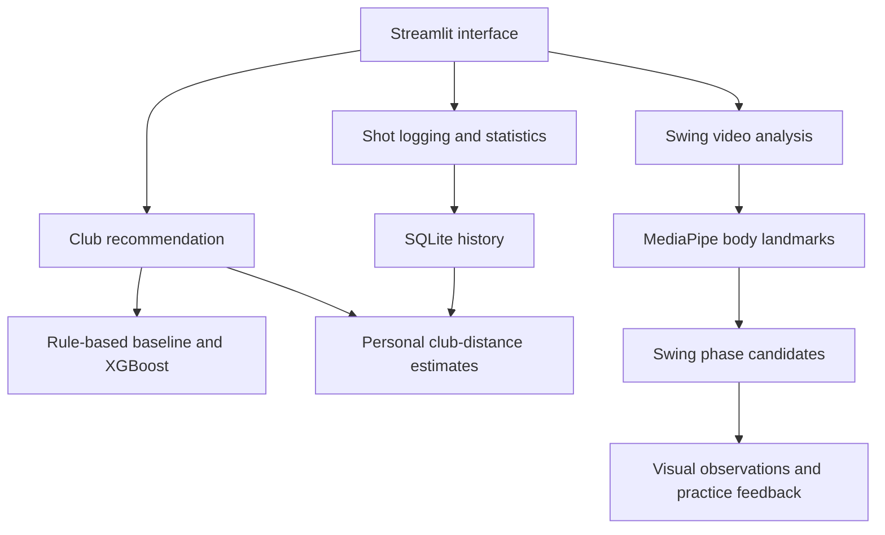

# Golf Caddy AI

**A golf assistant project combining club selection, personal shot history, and planned video-based swing feedback.**

**Status:** Python command-line prototype implemented. Machine learning, Bayesian personalisation, a web interface, and swing analysis are planned extensions.

[← All projects](../README.md)

## The problem

Choosing a club involves more than checking the distance to the pin. Conditions, the lie of the ball, and a player's own carry distances all matter. Improving a swing presents a related challenge: turning a recording into a small number of useful practice priorities.

Golf Caddy AI aims to bring these decisions into one application: explain a club recommendation, learn from logged shots, and provide visual feedback on a recorded swing.

## Current foundation

The existing Python application recommends clubs using distance, wind speed and direction, terrain, and player skill. It supports metric and imperial inputs and uses explicit recommendation rules.

A companion workflow provides local accounts, round and practice-session tracking, individual shot logging, and history stored in SQLite. Recommendation logic, terminal prompts, account handling, and storage are separated into modules.

## Planned feature: personalised club recommendations

The next stage extends the input schema with elevation, wind direction relative to the shot, and optional temperature. A rule-based baseline will be compared with an XGBoost classifier trained initially on synthetic scenarios.

Per-player club-distance estimates will update as shots are logged, using Bayesian updates to track a mean and uncertainty for each club. Population estimates will provide a fallback when a player has little history.

The intended interface shows a recommendation, alternatives, and an explanation of the factors behind it. Model confidence will be evaluated before being presented as a reliable probability.

## Planned feature: swing analysis

The proposed video pipeline uses MediaPipe Pose to extract body landmarks from face-on recordings and identify candidate address, top-of-backswing, and impact frames. Visual overlays will make detections inspectable.

The research stage will investigate which posture and movement indicators can be estimated reliably from that camera view. Suitable indicators will be compared with a reference set, with feedback organised into a primary observation, secondary observations, and relevant practice drills.

The planned app has four pages: **Recommend Club**, **Analyse Swing**, **Log a Shot**, and **My Stats**.

## Proposed architecture

The diagram below describes the target design; it does not represent the current implementation.

## Development roadmap

These are proposed milestones, rather than completed work or fixed delivery dates.

| Stage | Focus | Evidence of completion |
| --- | --- | --- |
| Weeks 1–2 | Input validation, 2,000 synthetic scenarios, a baseline, XGBoost, and personalisation | Held-out comparison and tests of how club-distance estimates adapt |
| Week 3 | Recommendation interface, explanations, and shot logging | A working recommender demo backed by SQLite |
| Weeks 4–5 | Pose extraction, phase detection, and reference measurements | Manually reviewed landmarks and keyframes; documented limits for each supported observation |
| Week 6 | Integrate video analysis and player statistics | One application with handling for unsupported videos and failed detections |
| Week 7 | Evaluate recommendations and swing observations | Results tables, error analysis, and documented failure modes |
| Week 8 | Writeup, screenshots, and demonstration | A concise case study and a two-to-three-minute demo |

## Evaluation plan

- **Recommendations:** compare top-1 and top-3 accuracy against the rule-based baseline on a held-out synthetic set, including a confusion matrix. Synthetic labels derived from rules cannot establish real-world superiority over those rules; validate with independent shot data when available.
- **Personalisation:** simulate a player whose 7-iron distance differs from the default by 20 metres, then measure estimation error as 30 shots are logged.
- **Swing analysis:** compare phase detections and supported observations with manual labels on ten unseen videos, separated from the reference and development sets. Report counts, agreement, and failures. Reserve final test videos until thresholds are fixed.
- **Usability:** demonstrate a recommendation, shot logging, and a supported video-analysis workflow in under three minutes.

No ML accuracy, personalisation improvement, or swing-analysis agreement results are available yet.

## Technology

| Implemented foundation | Planned additions |
| --- | --- |
| Python, SQLite, SQL, command-line interface | Python 3.11+, uv, XGBoost, Streamlit, MediaPipe Pose, NumPy, Parquet |

## Scope and limitations

The current recommender uses fixed rules, has gaps in its supported input combinations, and does not yet learn from shot history. Its local database is not encrypted.

The planned video feature is an experimental practice aid. A single camera view and body landmarks alone cannot reliably recover every rotation, club position, or wrist angle. Supported observations must be validated, and uncertain or occluded detections should be withheld. Reference swings are comparison examples rather than a universal definition of correct technique.

Only recordings with permission for the intended use will be included in development or public demonstrations. The full implementation, personal shot records, and private videos remain outside this public showcase.

**Source availability:** private implementation repository. This page documents the working foundation and the proposed next stages.
