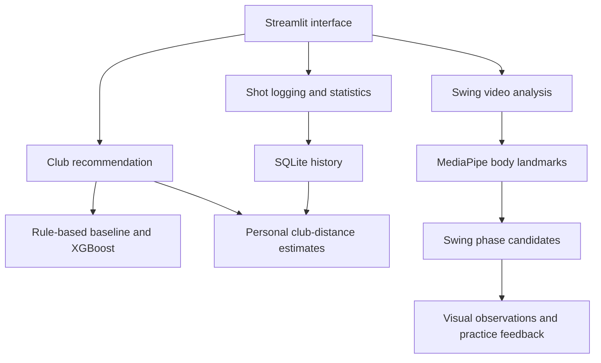

# Golf Caddy AI

A golf assistant for club selection and shot tracking, with personalisation and swing analysis planned next.

The Python terminal application is implemented. The ML model, web interface, and video analysis are still planned.

[Back to projects](../README.md)

## What works now

The app recommends a club from the distance to the target, wind conditions, terrain, and player skill. It accepts metric and imperial inputs and applies fixed recommendation rules.

Players can also create a local account, record rounds or practice sessions, and log individual shots. SQLite stores their history. The recommendation logic, terminal prompts, and storage live in separate modules.

This version has gaps: some combinations of inputs produce no recommendation, and logged shots do not yet change future suggestions. The local database is not encrypted.

## Learning a player's distances

A useful recommendation needs to account for how far that particular player hits each club. My next step is to maintain a distance estimate for each club and update it as shots are logged. Bayesian updates will track both the estimated mean and its uncertainty, with population averages as the starting point.

I also plan to add elevation, wind direction relative to the shot, and optional temperature to the inputs. An XGBoost classifier trained on synthetic scenarios will be compared with a rule-based baseline.

The interface should explain the choice in terms a player can check: the target distance, the effect of conditions, and their recorded club distances. Any confidence score needs evaluation before it can be treated as a reliable probability.

## Swing feedback from video

The other planned feature is a swing analyser. It will use MediaPipe Pose to locate body landmarks in face-on recordings and find candidate frames for address, the top of the backswing, and impact. Overlays will let users see what the system detected.

Before adding named swing faults, I need to establish which measurements are reliable from that camera angle. Body landmarks alone do not reliably reveal every rotation, wrist angle, or club position. Uncertain detections should produce no feedback rather than a confident diagnosis.

For observations that pass those checks, the app will show a main practice priority, secondary observations, and relevant drills. Reference swings will provide comparisons, without treating one professional's technique as the only correct way to swing.

Only recordings with permission for the intended use will be included in development or public demonstrations.

## How the planned app fits together

Streamlit will provide four pages: Recommend Club, Analyse Swing, Log a Shot, and My Stats. This diagram shows the proposed design.

## Development plan

The eight-week outline is a proposed sequence, not a delivery commitment. These milestones are still ahead.

| Stage | Work planned | How I will check it |
| --- | --- | --- |
| Weeks 1–2 | Define inputs, generate 2,000 synthetic scenarios, compare a baseline with XGBoost, and add personalisation | Held-out results and tests of how club-distance estimates change with new shots |
| Week 3 | Build the recommendation interface, explanations, and shot-logging page | A working recommender demo using SQLite |
| Weeks 4–5 | Extract poses, detect swing phases, and assess reference measurements | Manual review of landmarks and keyframes, with limits recorded for each measurement |
| Week 6 | Add swing analysis and player statistics to the app | A complete workflow that handles unsupported videos and failed detections |
| Week 7 | Evaluate recommendations and swing observations | Results tables and a record of errors and failure cases |
| Week 8 | Write up the work and record a demo | Screenshots and a two-to-three-minute demonstration |

## How I will evaluate it

For recommendations, I will compare top-1 and top-3 accuracy with the baseline on held-out synthetic data and inspect the confusion matrix. If the labels come from rules, reproducing them does not prove that the model makes better choices on a golf course. That claim would need independent shot data.

For personalisation, I will simulate a player whose 7-iron distance is 20 metres above the default and measure the estimation error as 30 shots are logged.

For swing analysis, I will compare phase detections and supported observations with manual labels on ten unseen videos. Those videos will be separate from the reference and development sets, and thresholds will be fixed before the final test. I will report agreement counts and failures, including problems caused by lighting, camera position, and occlusion.

There are no ML accuracy, personalisation, or swing-analysis results to report yet. The final demo should show a recommendation, shot logging, and a supported video workflow in under three minutes.

The current stack is Python and SQLite. The planned work uses Python 3.11+ with uv, XGBoost, Streamlit, MediaPipe Pose, NumPy, and Parquet.

The implementation, personal shot records, and private videos stay in the private project repository.
